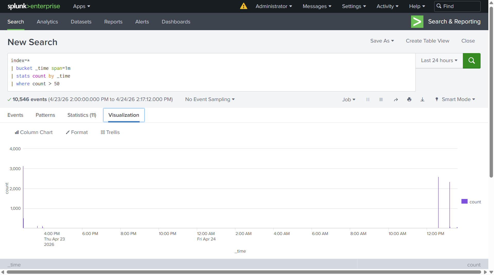
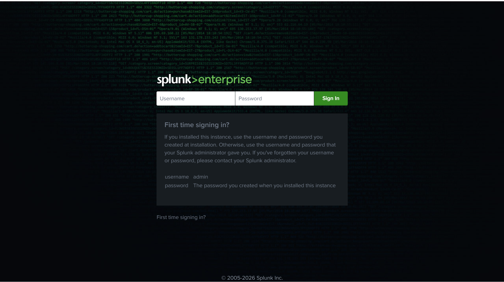
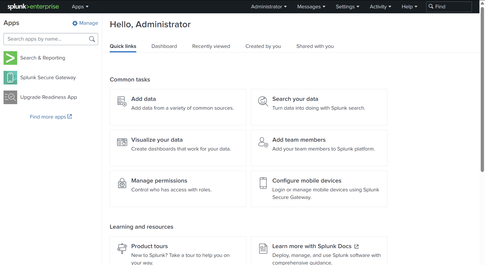
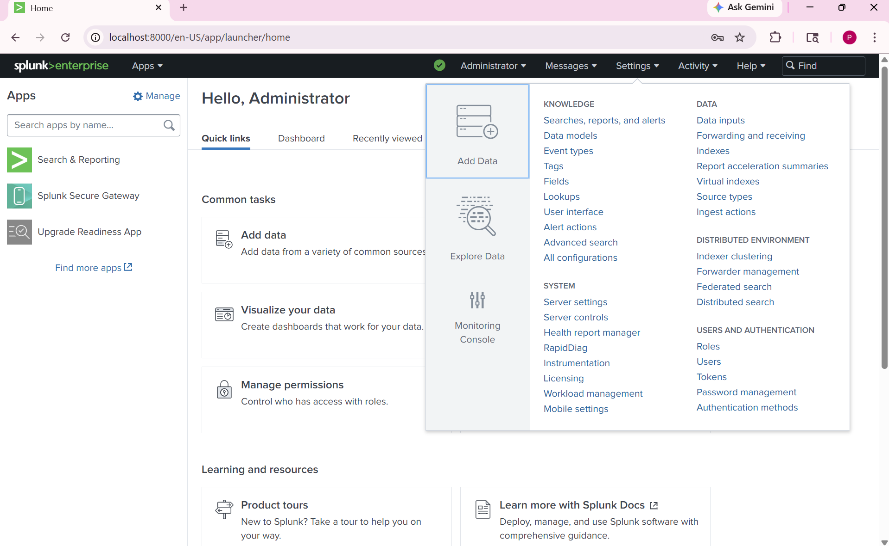
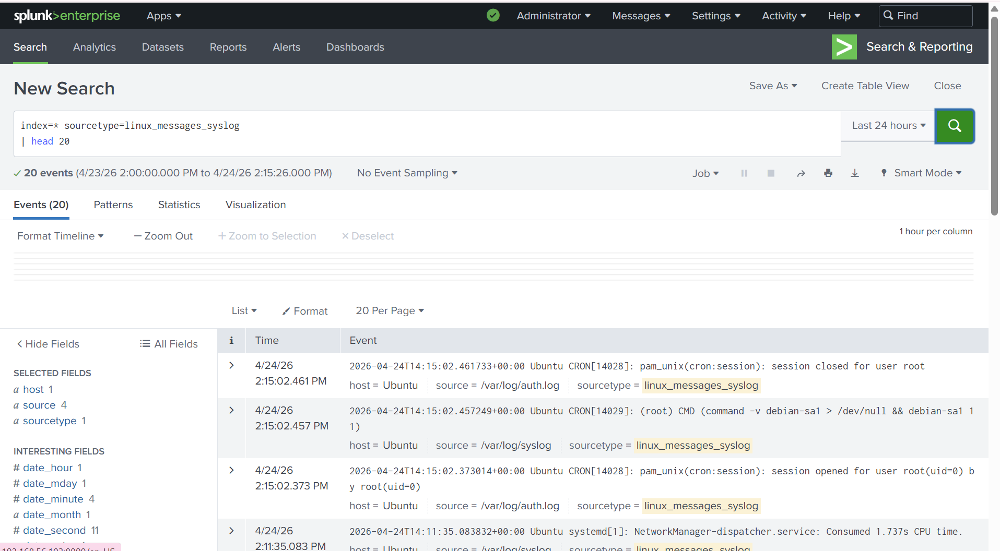
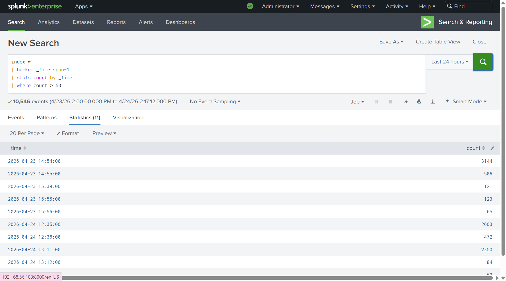

# 🔍 Port Scan Detection using Splunk SIEM

## 📌 Project Overview

This project demonstrates detection of port scanning activity using Splunk SIEM by analyzing Linux system logs and identifying abnormal spikes generated by Nmap scans.

---

## 🎯 Objectives

- Monitor logs in real time  
- Detect abnormal spikes  
- Create SPL queries  
- Visualize attack patterns  
- Configure alerts  

---

## 🛠️ Tools Used

- Splunk Enterprise  
- Ubuntu Linux  
- Kali Linux  
- Nmap  
- VirtualBox  

---

## ⚙️ System Setup

```bash
./splunk start
```

Access:
```
http://<target-ip>:8000
```

---

## 📥 Data Ingestion

Logs monitored from:

```
/var/log
```

Source type:
```
linux_messages_syslog
```

---

## 🔎 Log Verification

```spl
index=* sourcetype=linux_messages_syslog | head 20
```

---

## 🚨 Detection Query

```spl
index=*
| bucket _time span=1m
| stats count by _time
| where count > 50
```

---

## 📊 Detection Visualization

This graph clearly shows abnormal spikes in log activity during port scanning.



---

## 🔔 Alert Configuration

Alert is triggered when event count exceeds threshold.

---

## 📸 Screenshots

### 1. Splunk Login


### 2. Dashboard


### 3. Data Ingestion


### 4. Log Verification


### 5. Detection Query


### 6. Visualization (Key Result)


---

## ✅ Results

- Successfully detected port scan activity  
- Identified abnormal spikes  
- Visualized attack pattern  
- Configured alerts  

---

## 📚 Key Learnings

- SIEM fundamentals  
- SPL query creation  
- Log analysis  
- Attack detection  

---

## 🚀 Future Improvements

- IP-based detection  
- Email alerts  
- Advanced dashboards  

---

## 👩‍💻 Author

**Y. Pragnavi**  
Cybersecurity Enthusiast
