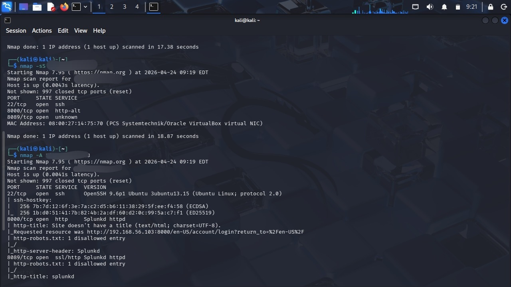

# 🔍 Port Scan Detection using Splunk SIEM

## 📌 Project Overview

This project demonstrates the detection of port scanning activity using Splunk SIEM in a controlled lab environment. System logs from a Linux machine are ingested into Splunk, analyzed using SPL queries, and monitored for abnormal activity patterns generated by network scanning tools such as Nmap.

The objective is to simulate real-world SOC (Security Operations Center) workflows, including log monitoring, anomaly detection, visualization, and alerting.


## 🎯 Objectives

- Monitor Linux system logs in real time  
- Simulate port scanning activity using Nmap  
- Identify abnormal spikes in log events  
- Develop detection logic using Splunk SPL  
- Visualize suspicious activity patterns  
- Configure alerts for automated detection  


## 🛠️ Tools and Technologies

- Splunk Enterprise  
- Ubuntu Linux (Log Source + SIEM Server)  
- Kali Linux (Attacker Machine)  
- Nmap (Port Scanning Tool)  
- Oracle VirtualBox  


## ⚙️ System Setup

### 1. Splunk Installation and Access

```bash
./splunk start
```

Access Splunk Web Interface:

```
http://<target-ip>:8000
```


### 2. Data Ingestion

- Navigate to: Add Data → Files & Directories  
- Select directory: `/var/log`  
- Enable continuous monitoring  
- Set source type: `linux_messages_syslog`  


### 3. Log Verification

```spl
index=* sourcetype=linux_messages_syslog | head 20
```


### 4. Attack Simulation

```bash
nmap -A <target-ip>
```


## 🔎 Detection Methodology

Port scanning generates a high volume of system events within a short time. This project uses an anomaly-based detection approach.


## 🚨 Detection Query

```spl
index=*
| bucket _time span=1m
| stats count by _time
| where count > 50
```


## 📊 Visualization

Spikes in Splunk charts indicate abnormal activity caused by port scanning.


## 🔔 Alert Configuration

- Alert Name: Port Scan Detection  
- Trigger Condition: `count > 50`  
- Type: Scheduled or Real-time  


## ✅ Results

- Port scanning successfully simulated  
- Logs ingested into Splunk  
- Detection query identified spikes  
- Alerts configured successfully  

---

## 📸 Screenshots

### Splunk Login


### Dashboard


### Data Ingestion


### Logs


### Nmap Scan


### Detection


### Visualization


---

## 📚 Key Learnings

- SIEM fundamentals using Splunk  
- Log analysis & SPL queries  
- Attack detection techniques  
- SOC workflow understanding  

---

## 🚀 Future Improvements

- Source IP-based detection  
- Advanced dashboards  
- Email alerting  
- More attack simulations  

---

## 🏁 Conclusion

This project demonstrates how Splunk SIEM can detect port scanning activity using anomaly-based log analysis.

---

## 👩‍💻 Author

**Y. Pragnavi**  
Cybersecurity Enthusiast
